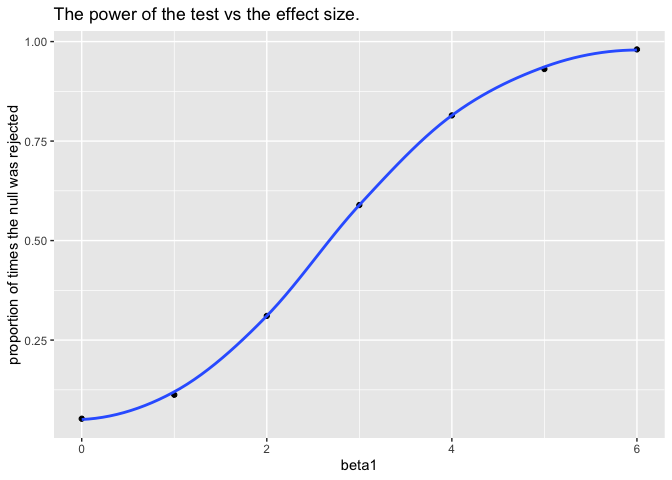

Homework 5
================
Jiarui Fu
11/7/2019

## Problem 1

The purpose of this problem is to fill in those missing values.

``` r
# load the iris dataset
# introduce some missing values in each column
# code chunk is provided
set.seed(10)

iris_with_missing = iris %>% 
  map_df(~replace(.x, sample(1:150, 20), NA)) %>%
  mutate(Species = as.character(Species))

# write a function that takes a vector as an argument, and returns the resulting vector
# for numeric variables, fill in missing values with the mean of non-missing values
# for character variables, fill in missing values with "virginica"
replace_missing_values = function(x) {
  if (is.numeric(x)) {
    x=replace_na(x, mean(x, na.rm = TRUE))}
  else if (is.character(x)) {
    x=replace_na(x, "virginca")}
}

# apply this function to the columns of iris_with_missing using a map statement
iris_new = map(iris_with_missing, replace_missing_values) 
as_tibble(iris_new)
```

    ## # A tibble: 150 x 5
    ##    Sepal.Length Sepal.Width Petal.Length Petal.Width Species
    ##           <dbl>       <dbl>        <dbl>       <dbl> <chr>  
    ##  1         5.1          3.5         1.4         0.2  setosa 
    ##  2         4.9          3           1.4         0.2  setosa 
    ##  3         4.7          3.2         1.3         0.2  setosa 
    ##  4         4.6          3.1         1.5         1.19 setosa 
    ##  5         5            3.6         1.4         0.2  setosa 
    ##  6         5.4          3.9         1.7         0.4  setosa 
    ##  7         5.82         3.4         1.4         0.3  setosa 
    ##  8         5            3.4         1.5         0.2  setosa 
    ##  9         4.4          2.9         1.4         0.2  setosa 
    ## 10         4.9          3.1         3.77        0.1  setosa 
    ## # … with 140 more rows

## Problem 2

``` r
# start with a dataframe containing all file names
files = list.files("data") 

# iterate over file names and read in data for each subject
# using map, save the result as a new variable in the dataframe
tidy_data = tibble(filename = files) %>% 
  mutate(
    subject_info = map(filename, ~read_csv(file.path("./data", .)))
    ) %>% 
  unnest(cols = subject_info) %>% 
  # tidy the result
  janitor::clean_names() %>% 
  # use pivot_longer to create new variables "week" and "observation"
  pivot_longer(
    week_1:week_8,
    names_to = "week", 
    values_to = "observation"
  ) %>% 
  # clean "week" variable by removing "week_"
  mutate_all(~gsub("week_", "", .)) %>% 
  # manipulate file names to include control arm and subject ID
  separate(filename, into = "id_group", sep = ".csv") %>% 
  separate(id_group, into = c("arm", "subject_id"), sep = "_") %>% 
  mutate(arm = recode(arm, "con" = "control", "exp" = "experimental")) %>% 
  # for plotting purpose - y axis scale consideration
  mutate(observation = as.numeric(observation))
```

    ## Warning: Expected 1 pieces. Additional pieces discarded in 160 rows [1, 2,
    ## 3, 4, 5, 6, 7, 8, 9, 10, 11, 12, 13, 14, 15, 16, 17, 18, 19, 20, ...].

``` r
tidy_data
```

    ## # A tibble: 160 x 4
    ##    arm     subject_id week  observation
    ##    <chr>   <chr>      <chr>       <dbl>
    ##  1 control 01         1            0.2 
    ##  2 control 01         2           -1.31
    ##  3 control 01         3            0.66
    ##  4 control 01         4            1.96
    ##  5 control 01         5            0.23
    ##  6 control 01         6            1.09
    ##  7 control 01         7            0.05
    ##  8 control 01         8            1.94
    ##  9 control 02         1            1.13
    ## 10 control 02         2           -0.88
    ## # … with 150 more rows

``` r
# make a spaghetti plot showing observations on each subject over time
# group = interaction: plots 10 lines for control and 10 lines for experimental over 8 weeks
ggplot(tidy_data, aes(x = week, y = observation, color = arm, 
                      group = interaction(arm, subject_id))) +
  geom_line()
```

<!-- -->

Differences: observations in the experimental group gradually increase
over the 8 weeks whereas there are basicallly no changes in the
observations in the control group during the 8 weeks’ period. Overall,
the observations in the experimental group are greater than the
observations in the control group.

## Problem 3

``` r
# set the following design elements
sim_regression = function(n = 30, beta0 = 2, sigma_sq = 50, beta1) {
  
  # create x and y functions, y follows the simple linear regression formula 
  sim_data = tibble(
    x = rnorm(n, mean = 0, sd = 1),
    y = beta0 + beta1 * x + rnorm(n, 0, sqrt(sigma_sq))
  )
  
  ls_fit = lm(y ~ x, data = sim_data)
  # use tidy to clean the output of lm
  summary = tidy(ls_fit) %>% 
    # only interested in b1 (x)
    filter(term == "x")
  
  # record beta1_hat and the p_value aring from the hypothesis testing in a tibble
  tibble(
  beta1_hat = summary$estimate,
  p_value = summary$p.value
  )
}

# generate 10000 datasets from the model above
# repeat the process for b1 = 0, 1, 2, 3, 4, 5, 6
sim_results = 
  tibble(beta1 = c(0, 1, 2, 3, 4, 5, 6)) %>% 
  mutate(
    output_lists = map(.x = beta1, ~rerun(10000, sim_regression(beta1 = .x))),
    estimate_dfs = map(output_lists, bind_rows)) %>% 
  select(-output_lists) %>% 
  unnest(estimate_dfs)

# make a plot showing the proportion of times the null was rejected on the y axis and the true value of β1 on the x axis
reject_proportion = 
  sim_results %>% 
  group_by(beta1) %>% 
  # reject the null: p value < α
  summarize(reject = length(which(p_value < 0.05)),
            total = n()) %>% 
  mutate(proportion = reject/total)

# add a regression trendline, smooth linear curve
ggplot(reject_proportion, aes(x = beta1, y = proportion)) + 
  geom_point() +
  geom_smooth(se = FALSE) +
  labs(y = "proportion of times the null was rejected",
       title = "The power of the test vs the effect size.")
```

    ## `geom_smooth()` using method = 'loess' and formula 'y ~ x'

<!-- -->

``` r
# sample average estimate of beta1_hat
average_estimate = 
  sim_results %>% 
  group_by(beta1) %>% 
  summarize(avg = mean(beta1_hat))

# sample's average estimate of beta1_hat for which the null was rejected
average_reject_null = 
  sim_results %>% 
  group_by(beta1) %>% 
  summarize(avg = mean(beta1_hat[p_value < 0.05]))

ggplot() +
  # make a plot showing the average estimate of β̂ 1 on the y axis and the true value of β1 on the x axis
  geom_point(average_estimate, mapping = aes(x = beta1, y = avg))+
  geom_smooth(average_estimate, mapping = aes(x = beta1, y = avg, color = "sample average"), se = FALSE) +
  # make a second plot - overlay on the first, the average estimate of β̂ 1 only in samples for which the null was rejected on the y axis and the true value of β1 on the x axis
  geom_point(average_reject_null, mapping = aes(x = beta1, y = avg)) +
  geom_smooth(average_reject_null, mapping = aes(x = beta1, y = avg, color = "samples for which the null was rejected"), se = FALSE) +
  labs(y = "average estimate of beta1_hat",
       title = "The average estimate of beta1_hat vs the true value of beta1.")
```

    ## `geom_smooth()` using method = 'loess' and formula 'y ~ x'
    ## `geom_smooth()` using method = 'loess' and formula 'y ~ x'

<!-- -->
